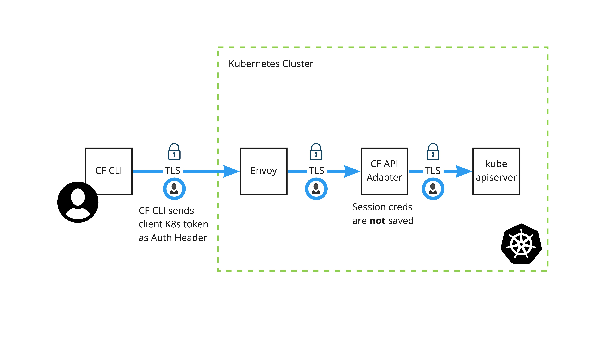

# User authentication overview

This topic describes how the Application Service Adapter authenticates and authorizes users using the Kubernetes API server.

##  Authentication and authorization overview

###  Background

Traditionally, the cf CLI authenticates with the Cloud Foundry [User Account and Authentication](https://docs.cloudfoundry.org/concepts/architecture/uaa.html) (UAA) server, which acts as an OAuth2 provider. In this model, the Cloud Foundry API server validates the user's token and authorizes user actions based on its own set of user role assignments.

The Application Service Adapter takes a different approach to user authentication and authorization. Instead of requiring UAA as a separate account and authentication service, the Application Service Adapter delegates this responsibility to the [Kubernetes API server](https://kubernetes.io/docs/reference/access-authn-authz/authentication/). The cf CLI now recognizes when it targets a Kubernetes-backed Cloud Foundry API server such as the Application Service Adapter, uses user info from the local kubeconfig file to authenticate with the underlying Kubernetes API, and extracts the user token or client certificate/key pair from the authentication response. When it makes a request to the Cloud Foundry API server, it then sends that credential in the Authorization header. The CF API server uses that credential to perform requests on behalf of the end user and retains it in memory only for the duration of the user's API request.

The Application Service Adapter relies on core Kubernetes role-based access control (RBAC) resources such as `ClusterRole` and `RoleBinding` to configure user authorization rules. Platform operators can create these RBAC resources either via the Cloud Foundry role API endpoints or directly in the Kubernetes API.

##  Architecture

The Application Service Adapter API requires that users connect to it via HTTPS because the Authorization header contains the user’s authentication token or client certificate or key pair. The API translates the Cloud Foundry API request into Kubernetes API requests using the provided credentials.

>**Note:** The user is authenticated through their Kubernetes token or client certificate or key for each request to the Adapter's API, with no persistent session data stored in-between.

###  Note on best practices

It is generally advisable to use short-lived tokens or certificates to authenticate with the Applicaton Service Adapter.
The Application Service Adapter warns users if their certificate is still valid in one week.
